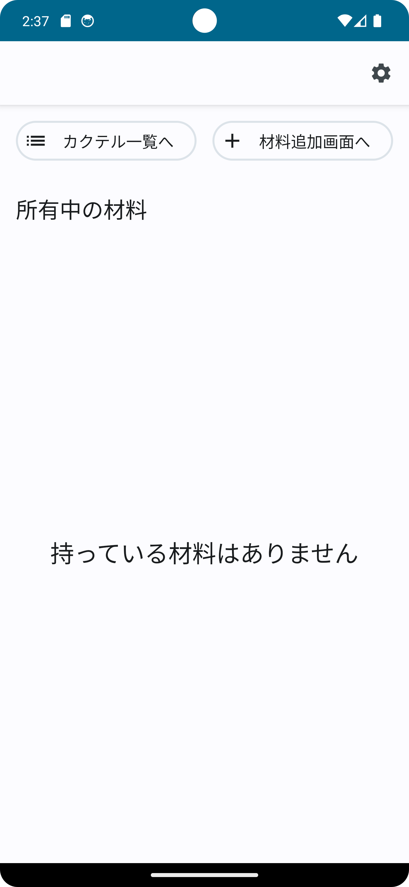
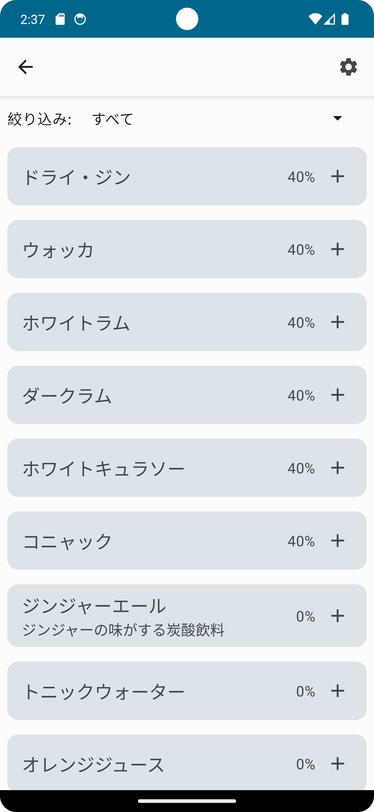
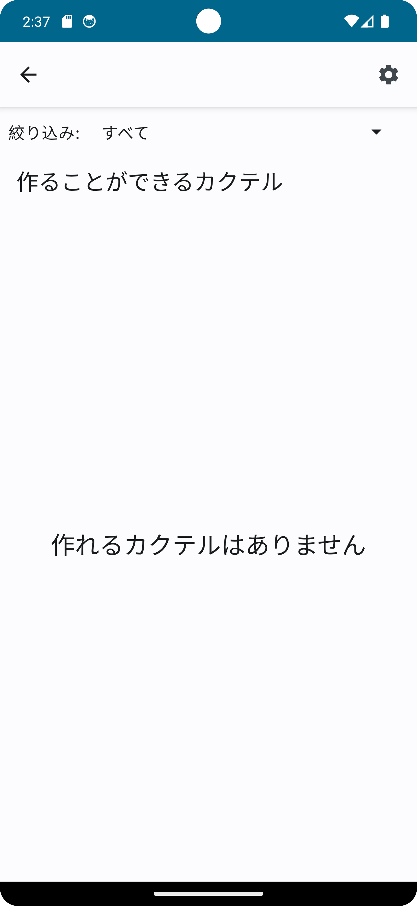

## APIサーバーの用意
プロダクトフレーバーを"emulator"に設定した場合は、[ここから](https://github.com/SEKI-YUTA/Cocktail_API_New)API側のプログラムをダウンロードして用意してください
プロダクトフレーバーを"physical"に設定した場合は、別途用意する必要はありません。

| トップ画面                                               | 素材追加画面　 | 作れるカクテル一覧画面 |
|-----------------------------------------------------|---------|-------------|
| </img> |</img>| </img>|
| 現在持っている材料があればリスト形式で表示されます。 | 新しく持っている材料に追加できます。 | 作れるカクテルの一覧が表示されます。 |

>**注意**
>設定画面は将来的に実装予定であり、現在はボタンを押しても何も起きません。