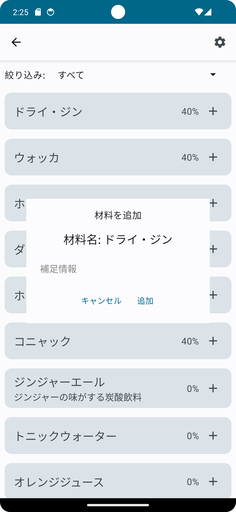
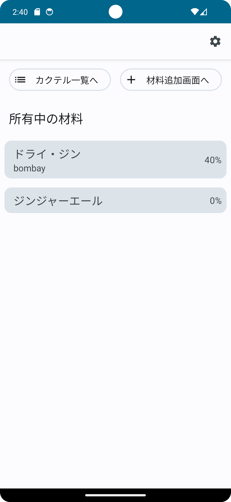
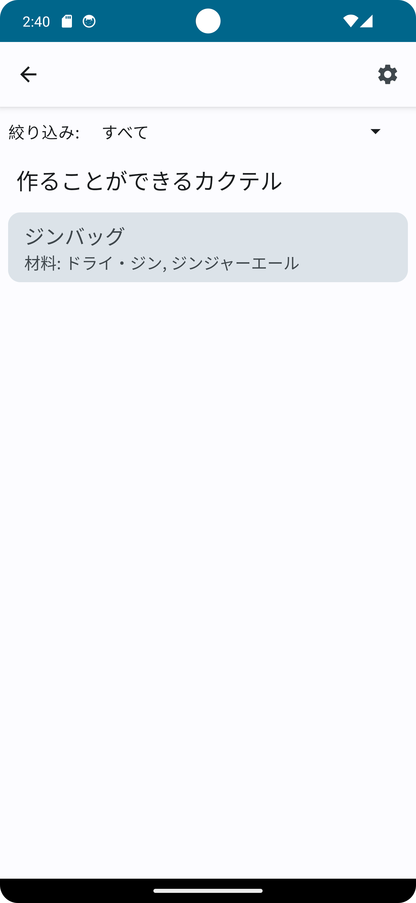

## API サーバーの用意

プロダクトフレーバーを"emulator"に設定した場合は、[ここから](https://github.com/SEKI-YUTA/Cocktail_API_New)API 側のプログラムをダウンロードして用意してください
プロダクトフレーバーを"physical"に設定した場合は、別途用意する必要はありません。

| トップ画面                                               | 素材追加画面　                                                | 作れるカクテル一覧画面                                            |
| -------------------------------------------------------- | ------------------------------------------------------------- | ----------------------------------------------------------------- |
| </img> | </img> | </img> |
| 現在持っている材料があればリスト形式で表示されます。     | 新しく持っている材料に追加できます。                          | 作れるカクテルの一覧が表示されます。                              |

> **注意**
> 設定画面は将来的に実装予定であり、現在はボタンを押しても何も起きません。

## アプリの使い方

素材追加画面で、既に持っている材料を選択して追加します。

| 番号 | 説明 | 画像 |
| --- | --- | --- |
|1.材料の追加 | 素材をタップするとダイアログが表示されるので補足情報(例えば銘柄など）をがあれば入力します。 | </img> |
| 2.作れるカクテルの検索を実行 | 材料を追加するのが終わるとトップ画面に戻り、左上にある「カクテル一覧へ」ボタンを押します。 | </img> |
| 3.作れるカクテルを確認 | 2 でボタンを押すと、作れるカクテル一覧画面へ遷移します。ここに表示されているのが現在作る事が出来るカクテルにになります。 | </img> |

### 更新予定
- カクテルの情報の追加
- カクテルから材料を検索する機能の追加
- 作れるカクテルを選択した際に、作り方を表示する
